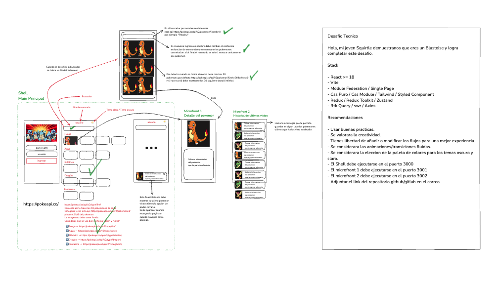
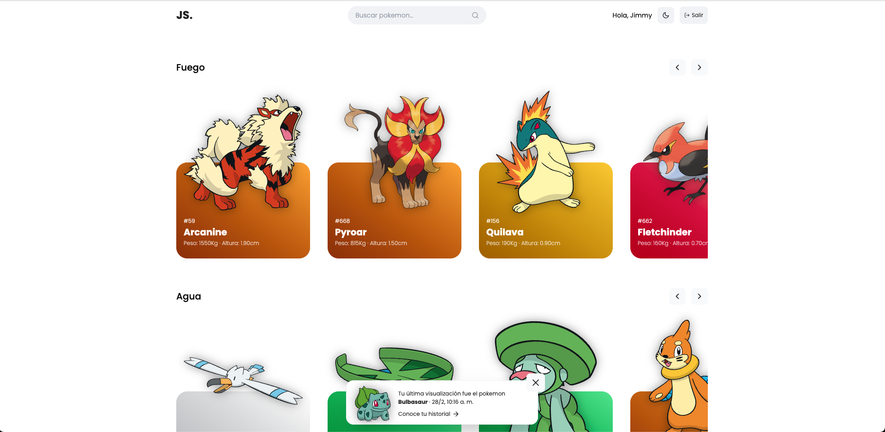

# Prueba técnica para Apuesta total

Este proyecto se realizó en el siguiente stack:

1. React >= 19
2. TailwindCss
3. Redux Toolkit
4. React Router
5. Microfrontend usando Module Federation: @originjs/vite-plugin-federation

Se hace uso de la siguiente librería:

- [@originjs/vite-plugin-federation](https://www.npmjs.com/package/@originjs/vite-plugin-federation) para implementar la conexión entre microfrontends

## Levantar los proyectos

Por favor, debe realizar los pasos en orden para lograr levantar los microfrontends. Tenemos un shell(at-challenge) y 2 microfrontends 1 y 2.

Asegurese de instalar pnpm, usando npm

```bash
npm install -g pnpm@latest-10
```

o

```bash
npm install -g @pnpm/exe@latest-10
```

### Iniciar Microfrontend 1

Abre una nueva terminal, y asegurarse de estar en el repositorio de microfront1

```bash
cd microfront1
pnpm install
pnpm run build && pnpm run preview
```

Se levantará el microfront1 en el puerto 3001
Miralo en: [http://localhost:3001](http://localhost:3001)

### Iniciar Microfrontend 2

Abre una nueva terminal, y asegurarse de estar en el repositorio de microfront2

```bash
cd microfront2
pnpm install
pnpm run build && pnpm run preview
```

Se levantará el microfront2 en el puerto 3002
Miralo en: [http://localhost:3002](http://localhost:3002)

### Iniciar el host o shell

Abre una nueva terminal, y asegurarse de estar en el repositorio de at-challenge

```bash
pnpm install
pnpm run dev
```

Se levantará el host en el puerto 3000
Miralo en: [http://localhost:3000](http://localhost:3000)

Para más información las configuraciones se encuentra dentro de cada archivo `vite.config.js`.

## Prueba 📸



## Mi resultado 📸


